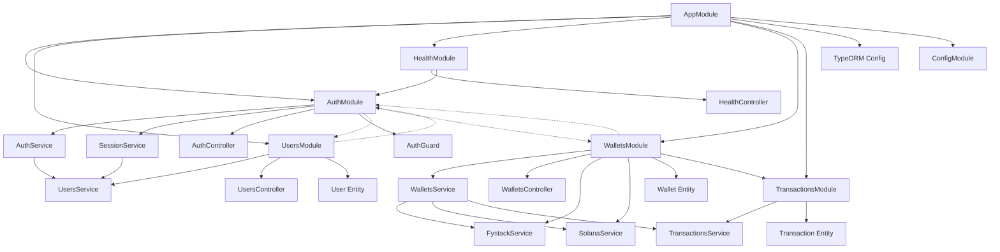
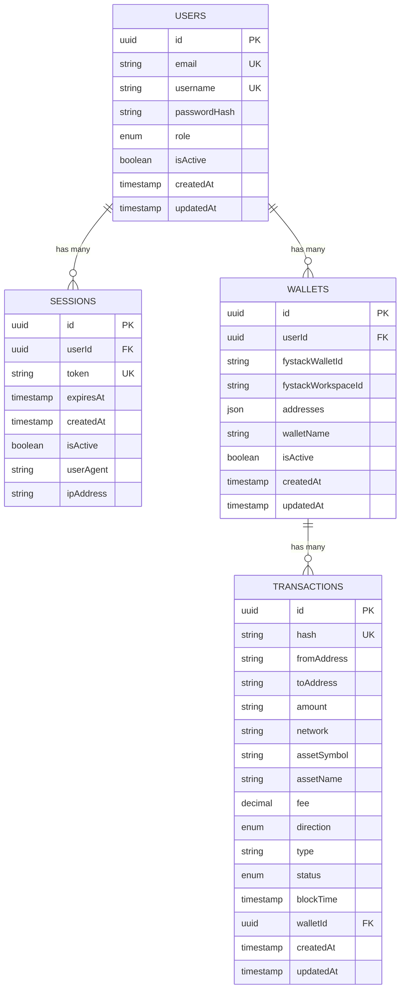
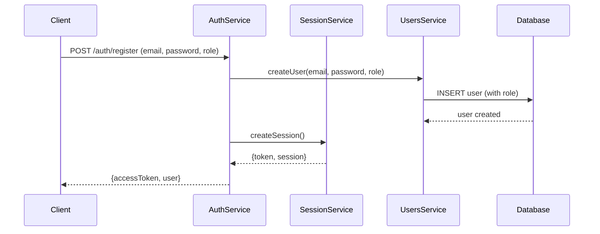
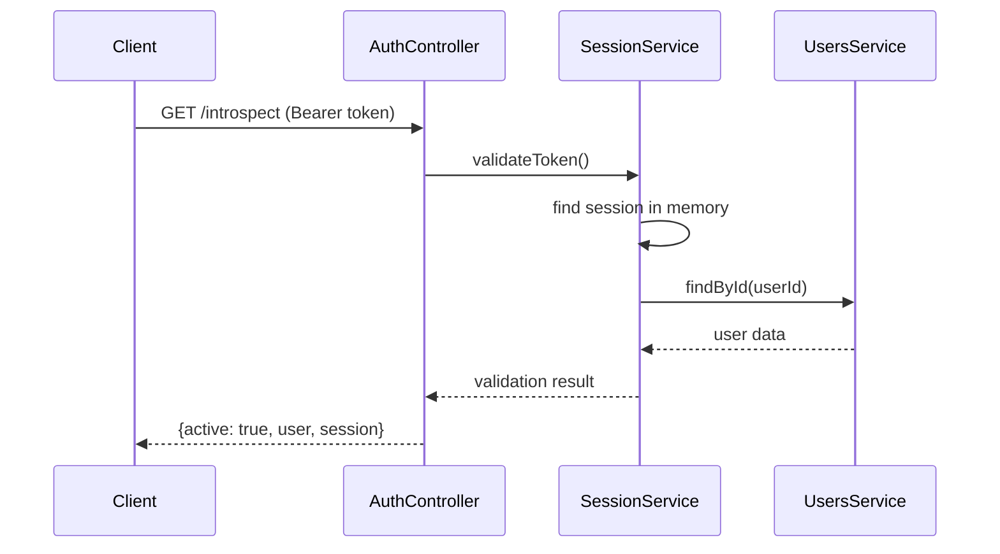

# Backend Logic & Database Architecture

## ✅ Implementation Status

### Completed Features
- ✅ **Authentication System**: Opaque token-based authentication với Redis session management
- ✅ **User Management**: Registration, login, profile management với role-based access
- ✅ **MPC Wallet Integration**: Tích hợp hoàn chỉnh với Fystack để tạo và quản lý ví MPC
- ✅ **Solana Blockchain Integration**: Kết nối trực tiếp với Solana network để lấy balance và transactions
- ✅ **Session Management**: Multi-session support với logout và logout-all functionality
- ✅ **Database Schema**: Users, Wallets, Sessions tables với proper relationships
- ✅ **Health Monitoring**: Comprehensive health checks cho service monitoring
- ✅ **API Documentation**: Swagger OpenAPI 3.0 documentation cho tất cả endpoints
- ✅ **Database Seeding**: Automatic sample data creation cho development
- ✅ **Redis Integration**: Session storage và caching layer
- ✅ **Transaction History**: Lấy transaction history từ Solana blockchain
- ✅ **USDC Balance**: Real-time USDC-DEV balance từ Solana network

### Current System Capabilities
🎯 **Hệ thống hiện tại hỗ trợ**:
- ✅ User registration → Auto MPC wallet creation via Fystack
- ✅ Login → Access wallet information và session management
- ✅ Real-time USDC balance từ Solana blockchain
- ✅ Transaction history từ Solana network
- ✅ Multi-session management (logout specific session hoặc all sessions)
- ✅ Wallet withdraw functionality via Fystack
- ✅ Deposit address generation
- ✅ Wallet name management
- ✅ Health monitoring và readiness/liveness probes

### Ready for Production
- **Docker Environment**: `docker-compose up --build -d`
- **Local Development**: `npm run start:dev`
- **API Documentation**: `http://localhost:3000/api`
- **Health Check**: `http://localhost:3000/health`
- **Readiness Probe**: `http://localhost:3000/health/ready`
- **Liveness Probe**: `http://localhost:3000/health/live`

### Sample Test Data
```
Seeded users được tạo tự động khi start application:
- Admin user với MPC wallet
- Regular users với MPC wallets
- Sample transaction data
```

---

## 📋 Table of Contents
1. [Implementation Status](#implementation-status)
2. [System Overview](#system-overview)
3. [User Roles & Permissions](#user-roles--permissions)
4. [Current Architecture](#current-architecture)
5. [Database Schema](#database-schema)
6. [Authentication System](#authentication-system)
7. [API Endpoints](#api-endpoints)
8. [Database Seeding](#database-seeding)
9. [Future: Custodial Wallet Integration](#future-custodial-wallet-integration)

## 🏗️ System Overview

### Technology Stack
- **Framework**: Fastify (TypeScript)
- **Database**: PostgreSQL với Prisma ORM
- **Session Store**: Redis cho session management và caching
- **Authentication**: Opaque Token-based sessions
- **Password Hashing**: Argon2
- **MPC Wallet Provider**: Fystack
- **Blockchain Integration**: Solana Web3.js
- **Container**: Docker & Docker Compose
- **API Documentation**: Swagger/OpenAPI 3.0 với Fastify Swagger

### Core Architecture
```
src/
├── server.ts              # Main application entry point & server setup
├── plugins/               # Fastify plugins
│   ├── auth.ts           # Authentication plugin với session management
│   ├── cors.ts           # CORS configuration
│   ├── database.ts       # Prisma database plugin
│   └── swagger.ts        # Swagger documentation plugin
├── routes/                # API route handlers
│   ├── auth.ts           # Authentication routes (register, login, logout, sessions)
│   ├── users.ts          # User management routes
│   ├── wallets.ts        # Wallet management routes
│   └── health.ts         # Health check routes
├── services/              # Business logic services
│   ├── fystack.service.ts    # Fystack MPC wallet integration
│   ├── solana.service.ts     # Solana blockchain integration
│   ├── session.service.ts    # Session management với Redis
│   └── transactions.service.ts # Transaction history logic
└── types/                 # TypeScript type definitions
    └── fastify.d.ts      # Fastify type extensions
```

### Database Schema (Prisma)
```
prisma/
├── schema.prisma          # Prisma schema definition
└── migrations/            # Database migration files
```

## 🧑‍🤝‍🧑 User Roles & Permissions

The application defines two primary user roles, each with distinct purposes:

-   **`CLIENT`**: Represents standard users of the application. They can access core features, manage their profile, and interact with the platform's main functionalities. This is the default role on registration.
-   **`WORKER`**: Represents users who perform tasks or provide services within the platform. They may have access to a different set of tools and dashboards related to their work.

Role-based access control (RBAC) will be implemented using NestJS Guards to restrict access to specific routes and services based on these roles.

## 🏛️ Current Architecture

### Module Dependencies


### Service Layer Architecture
- **AuthService**: Orchestrates authentication flows (register, login, logout) và tự động tạo MPC wallet
- **SessionService**: Manages opaque tokens và session lifecycle với Redis storage
- **UsersService**: Handles user CRUD operations và password validation
- **WalletsService**: ✅ Manages wallet operations, FyStack integration, và Solana blockchain queries
- **FystackService**: ✅ Handles MPC wallet creation, management, và withdrawal operations
- **SolanaService**: ✅ Handles Solana blockchain integration for balance và transaction history
- **TransactionsService**: ✅ Manages transaction data storage và retrieval from database

## 🗄️ Database Schema

### Prisma Schema Overview
The application uses Prisma ORM with PostgreSQL database. Below are the current models and their relationships:

### Enums
```prisma
enum UserRole {
  WORKER
  CLIENT
}

enum TransactionStatus {
  PENDING
  CONFIRMED
  FAILED
  PENDING_APPROVAL
}

enum TransactionDirection {
  IN
  OUT
}
```

### Models

#### User Model
```prisma
model User {
  id                     String   @id @default(uuid())
  email                  String   @unique
  username               String   @unique
  passwordHash           String   @map("password_hash")
  role                   UserRole @default(CLIENT)
  isActive               Boolean  @default(true) @map("is_active")
  createdAt              DateTime @default(now()) @map("created_at")
  updatedAt              DateTime @updatedAt @map("updated_at")

  // Relations
  wallets                Wallet[]
  sessions               Session[]

  @@map("users")
}
```

#### Session Model
```prisma
model Session {
  id          String   @id @default(uuid())
  userId      String   @map("user_id")
  token       String   @unique
  expiresAt   DateTime @map("expires_at")
  createdAt   DateTime @default(now()) @map("created_at")
  isActive    Boolean  @default(true) @map("is_active")
  userAgent   String?  @map("user_agent")
  ipAddress   String?  @map("ip_address")

  // Relations
  user        User     @relation(fields: [userId], references: [id], onDelete: Cascade)

  @@index([token])
  @@index([userId])
  @@index([expiresAt])
  @@map("sessions")
}
```

#### Wallet Model
```prisma
model Wallet {
  id                     String   @id @default(uuid())
  userId                 String   @map("user_id")
  fystackWalletId        String   @map("fystack_wallet_id")
  fystackWorkspaceId     String   @map("fystack_workspace_id")
  addresses              Json     @map("addresses")
  walletName             String   @map("wallet_name")
  isActive               Boolean  @default(true) @map("is_active")
  createdAt              DateTime @default(now()) @map("created_at")
  updatedAt              DateTime @updatedAt @map("updated_at")

  // Relations
  user                   User          @relation(fields: [userId], references: [id])
  transactions           Transaction[]

  @@map("wallets")
}
```

#### Transaction Model
```prisma
model Transaction {
  id            String               @id @default(uuid())
  hash          String?              @unique
  fromAddress   String
  toAddress     String
  amount        String
  network       String
  assetSymbol   String
  assetName     String
  fee           Decimal?             @db.Decimal(20, 10)
  direction     TransactionDirection?
  type          String
  status        TransactionStatus    @default(PENDING)
  blockTime     DateTime
  walletId      String
  createdAt     DateTime             @default(now())
  updatedAt     DateTime             @updatedAt

  // Relations
  wallet        Wallet               @relation(fields: [walletId], references: [id])

  @@index([walletId, blockTime])
  @@map("transactions")
}
```

### Entity Relationships


## 🔐 Authentication System

### Opaque Token Architecture
The system uses **opaque tokens** instead of JWT for enhanced security:

#### Token Generation
```typescript
// 32 bytes random data → base64url encoding
const randomBytes = crypto.randomBytes(32);
const token = randomBytes
  .toString('base64')
  .replace(/\+/g, '-')
  .replace(/\//g, '_')
  .replace(/=/g, '');
```

#### Session Storage (In-Memory)
```typescript
interface Session {
  id: string;           // UUID
  userId: string;       // User UUID
  token: string;        // Opaque token
  expiresAt: Date;      // 24h default
  createdAt: Date;
  isActive: boolean;
  userAgent?: string;
  ipAddress?: string;
}
```

### Authentication Flow


### Token Validation


## 🛠️ API Endpoints

### Authentication Endpoints
```
POST   /auth/register     # User registration
POST   /auth/login        # User login
POST   /auth/logout       # Single session logout
POST   /auth/logout-all   # All sessions logout
POST   /auth/refresh      # Token refresh
GET    /auth/sessions     # Get user sessions
GET    /auth/introspect   # Token introspection
GET    /introspect        # Alternative introspection endpoint
```

#### Registration Request Body
```json
{
  "email": "user@example.com",
  "username": "username123",
  "password": "strongPassword123!",
  "role": "client"
}
```

**Role Options:**
- `client` (default) - Standard platform user
- `worker` - Service provider/task performer

### User Management Endpoints
```
GET    /users/profile     # Get current user profile
PUT    /users/profile     # Update user profile
GET    /users             # Get all users (admin)
DELETE /users/:id         # Deactivate user (admin)
```

### Wallet Information Management Endpoints ✅ IMPLEMENTED
```
GET    /wallets                    # Get all wallets for the authenticated user
GET    /wallets/:walletId          # Get details for a specific wallet
GET    /wallets/:walletId/balances # Get balances for a specific wallet (read-only from FyStack)
GET    /wallets/:walletId/transactions # Get transaction history (read-only from FyStack)
PUT    /wallets/:walletId/name     # Update wallet name
DELETE /wallets/:walletId          # Deactivate a wallet
```

**Removed Endpoints (Out of Scope):**
```
❌ POST /wallets/:walletId/transactions  # Transaction creation → Handled by a separate payment system
❌ POST /wallets/:walletId/withdraw      # Withdrawal → Handled by a separate payment system
```

### Health Check
```
GET    /health            # Application health status
```

