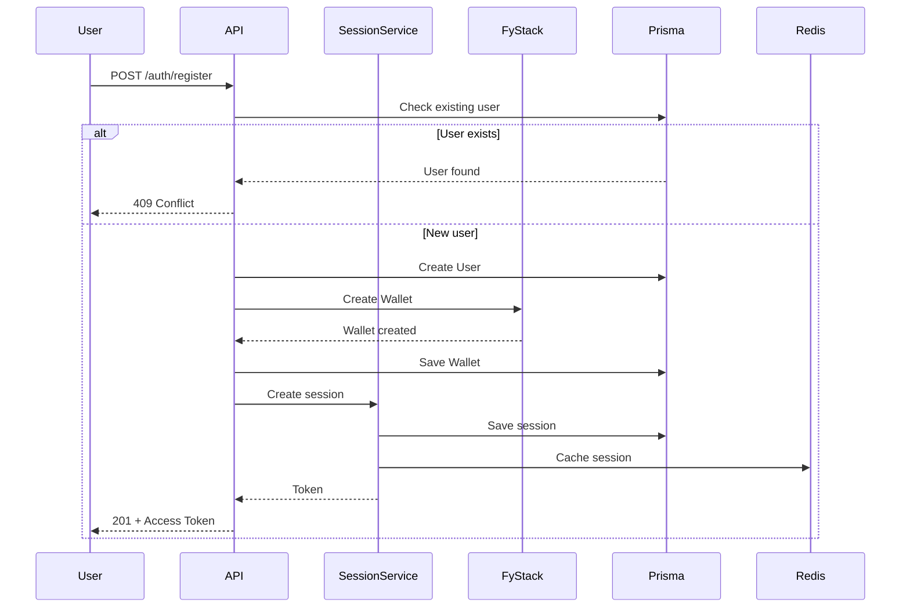
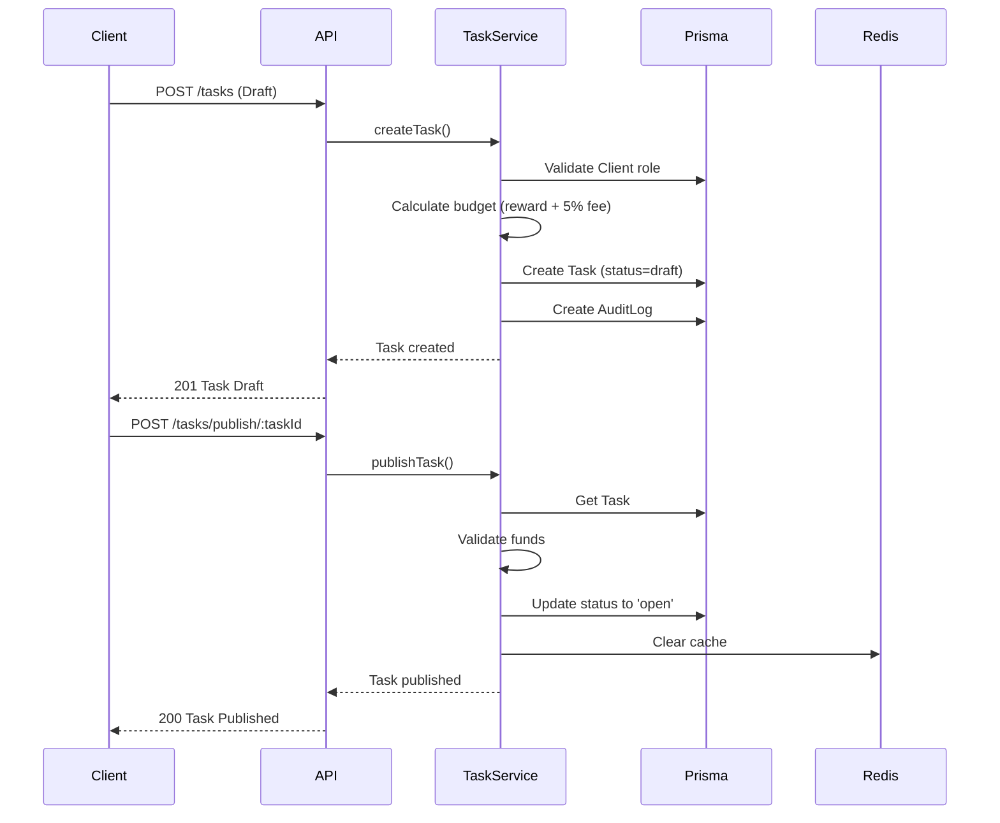
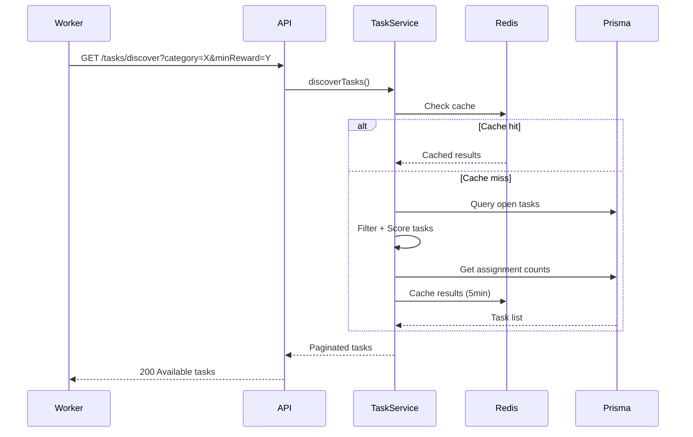
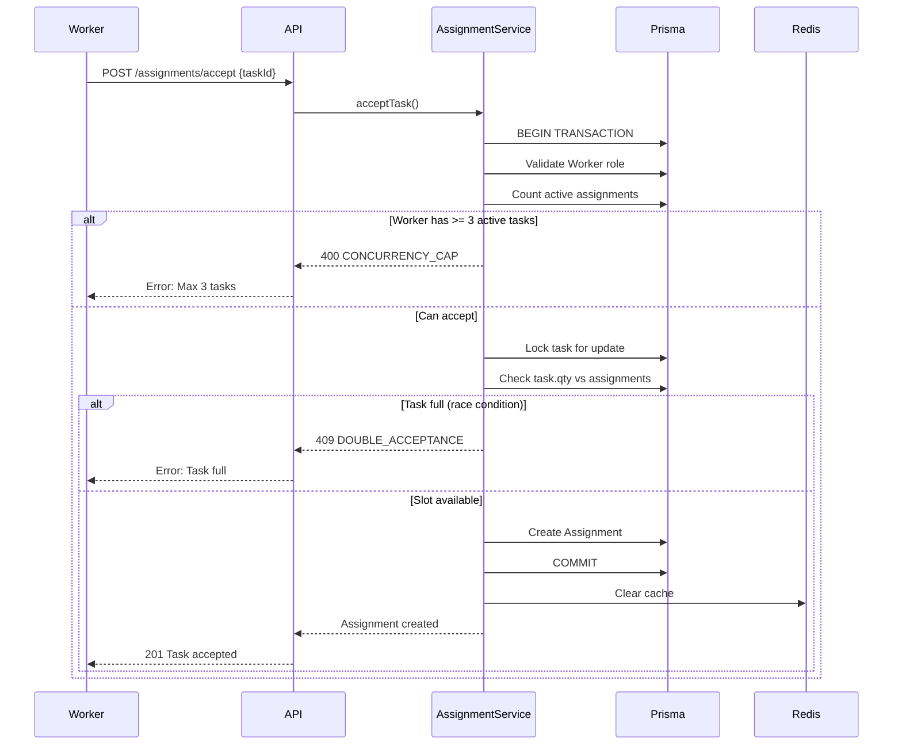
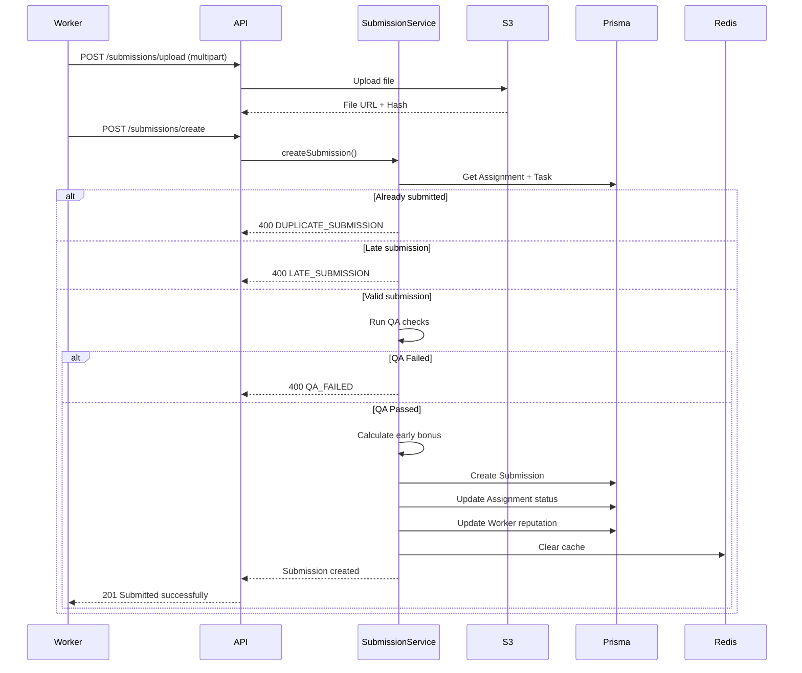
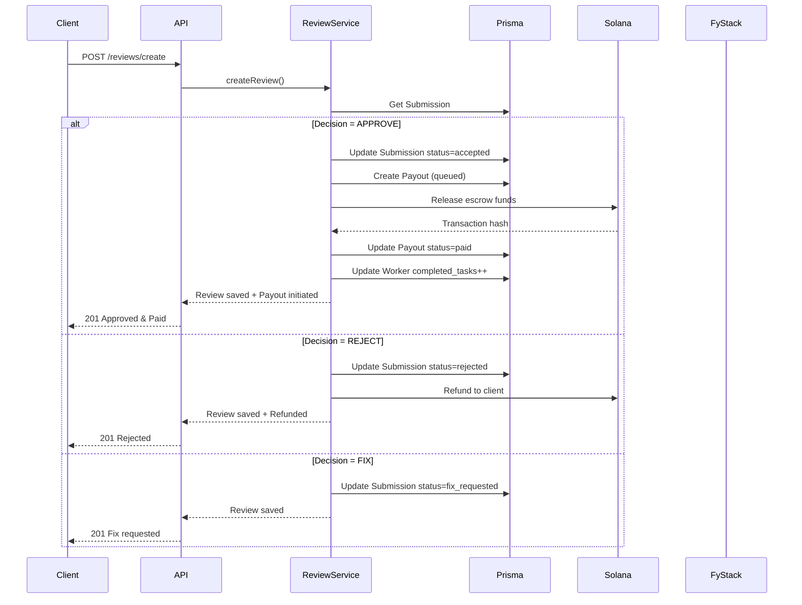
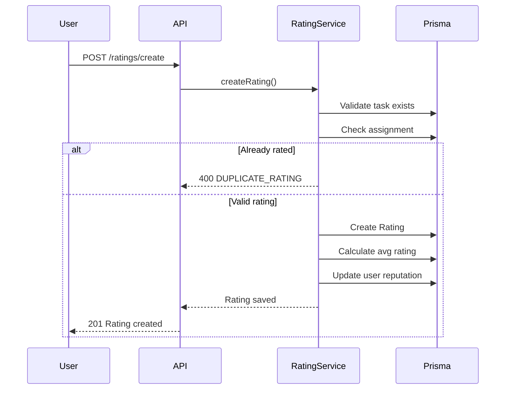
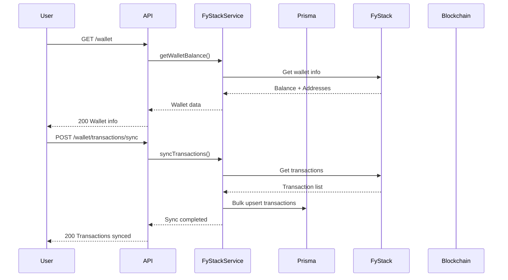

# PayTask Worker API - Complete System Flow

## 📋 Table of Contents
- [System Overview](#system-overview)
- [Architecture Diagram](#architecture-diagram)
- [Core Flows](#core-flows)
- [Database Schema](#database-schema)
- [API Endpoints](#api-endpoints)
- [Services & Business Logic](#services--business-logic)

---

## 🎯 System Overview

**PayTask Worker API** là một nền tảng kết nối Client (người tạo công việc) và Worker (người làm việc) thông qua hệ thống task-based payment.

### Tech Stack
- **Runtime**: Node.js + TypeScript
- **Framework**: Fastify
- **Database**: PostgreSQL (Prisma ORM)
- **Cache**: Redis + Bull Queue
- **Blockchain**: Solana Web3.js
- **Storage**: AWS S3
- **Auth**: Session-based (JWT-like tokens)
- **Payment**: FyStack Integration

---

## 🏗️ Architecture Diagram

```
┌─────────────────────────────────────────────────────────────────┐
│                         CLIENT LAYER                             │
│  (Web/Mobile Apps - Workers & Clients)                          │
└─────────────────────┬───────────────────────────────────────────┘
                      │
                      │ HTTP/REST API
                      ▼
┌─────────────────────────────────────────────────────────────────┐
│                      FASTIFY SERVER                              │
│  ┌──────────────────────────────────────────────────────────┐  │
│  │  Plugins: CORS, Helmet, Swagger, Multipart              │  │
│  │  Auth Middleware (Session Validation)                    │  │
│  └──────────────────────────────────────────────────────────┘  │
│                                                                  │
│  ┌────────────────── ROUTES ─────────────────────────────┐     │
│  │  /auth          - Authentication & Registration        │     │
│  │  /tasks         - Task CRUD & Discovery               │     │
│  │  /assignments   - Task Acceptance & Management         │     │
│  │  /submissions   - Work Submission & QA                 │     │
│  │  /reviews       - Client Review & Approval             │     │
│  │  /ratings       - Rating System                        │     │
│  │  /stats         - Statistics & Analytics               │     │
│  │  /wallet        - Wallet & Transactions                │     │
│  │  /errorlog      - Error Monitoring                     │     │
│  └─────────────────────────────────────────────────────────┘    │
└─────────────────────┬───────────────────────────────────────────┘
                      │
                      ▼
┌─────────────────────────────────────────────────────────────────┐
│                     SERVICE LAYER                                │
│  ┌──────────────┐  ┌──────────────┐  ┌──────────────┐          │
│  │ Task Service │  │Assignment    │  │Submission    │          │
│  │              │  │Service       │  │Service       │          │
│  └──────────────┘  └──────────────┘  └──────────────┘          │
│  ┌──────────────┐  ┌──────────────┐  ┌──────────────┐          │
│  │Review Service│  │Rating Service│  │User Service  │          │
│  └──────────────┘  └──────────────┘  └──────────────┘          │
│  ┌──────────────┐  ┌──────────────┐  ┌──────────────┐          │
│  │Stats Service │  │Session Svc   │  │Transaction   │          │
│  └──────────────┘  └──────────────┘  │Service       │          │
│                                       └──────────────┘          │
└─────────┬───────────────────┬────────────────┬──────────────────┘
          │                   │                │
          ▼                   ▼                ▼
┌──────────────────┐  ┌──────────────┐  ┌─────────────────┐
│   PostgreSQL     │  │    Redis     │  │ External APIs   │
│   (Prisma)       │  │              │  │                 │
│                  │  │ • Caching    │  │ • FyStack       │
│ • Users          │  │ • Bull Queue │  │ • Solana RPC    │
│ • Tasks          │  │ • Sessions   │  │ • AWS S3        │
│ • Assignments    │  │              │  │                 │
│ • Submissions    │  └──────────────┘  └─────────────────┘
│ • Wallets        │
│ • Transactions   │
└──────────────────┘
```

---

## 🔄 Core Flows

### 1️⃣ **User Registration & Authentication Flow**



**Flow Steps:**
1. User gửi thông tin đăng ký (username, email, password, role)
2. Kiểm tra user đã tồn tại chưa (email/username)
3. Hash password bằng bcrypt
4. Tạo User record trong database
5. Tạo FyStack Wallet tự động (qua FyStack API)
6. Tạo WorkerProfile nếu role = 'worker'
7. Tạo Session token (30 ngày expiry)
8. Cache session vào Redis
9. Trả về access token + user info + wallet info

---

### 2️⃣ **Task Creation Flow (Client)**



**Flow Steps:**
1. **Create Draft**: Client tạo task với title, reward, qty, deadline
2. **Calculate Budget**: 
   - Reward Total = reward × qty
   - Fee = 5% of reward total
   - Budget = reward total + fee
3. **Publish Task**: 
   - Validate client có đủ tiền (check wallet balance)
   - Lock funds in escrow (via blockchain transaction)
   - Update task status: draft → open
4. **Task becomes discoverable** for workers

---

### 3️⃣ **Task Discovery Flow (Worker)**



**Filtering & Scoring Logic:**
- **Filters**: category, minReward, maxReward, search keywords
- **Scoring Algorithm**:
  - Base score from reward amount
  - Bonus for urgent tasks (deadline < 24h)
  - Penalty for low reputation clients
  - Randomization for fairness
- **Pagination**: Default 20 tasks/page
- **Cache**: Redis 5 minutes

---

### 4️⃣ **Task Acceptance Flow (Worker)**



**Concurrency Control:**
- **Worker Limit**: Max 3 active assignments per worker
- **Optimistic Locking**: Prevents race conditions when multiple workers accept same task
- **Transaction Isolation**: SERIALIZABLE level
- **First-wins strategy**: First successful transaction gets the task

---

### 5️⃣ **Work Submission Flow**



**QA Checks:**
1. **Completeness**: File có đầy đủ không?
2. **Format**: File format đúng không?
3. **Size**: File size trong giới hạn?
4. **Duplicate**: Có phải duplicate submission không?
5. **Hash Verification**: SHA256 hash khớp không?

**Early Submission Bonus:**
- Submit < 50% time: +10 reputation points
- Submit < 75% time: +5 reputation points
- On-time: 0 bonus
- Late: Rejected

---

### 6️⃣ **Review & Payout Flow (Client)**



**Review Decisions:**
- **APPROVE**: Release payment to worker
- **REJECT**: Refund to client, worker gets nothing
- **FIX**: Worker có cơ hội resubmit (1 lần)

---

### 7️⃣ **Rating System Flow**



**Rating Rules:**
- Client can rate Worker after submission
- Worker can rate Client after payment
- Score: 1-5 stars
- Cannot rate twice for same task
- Average rating updates user reputation

---

### 8️⃣ **Wallet & Transaction Flow**



**FyStack Integration:**
- Auto-create wallet on registration
- Support multiple chains (SOL, ETH, etc.)
- Track all incoming/outgoing transactions
- Sync periodically via webhook or polling

---

## 📊 Database Schema

### **Core Tables**

#### Users
```typescript
User {
  id: UUID (PK)
  email: String (unique)
  username: String (unique)
  passwordHash: String
  role: UserRole (client | worker)
  isActive: Boolean
  fystackSessionCookie: String?
  createdAt: DateTime
  updatedAt: DateTime
}
```

#### Tasks
```typescript
Task {
  id: UUID (PK)
  clientId: UUID (FK → User)
  title: String
  description: String?
  category: String?
  reward: Decimal (per unit)
  qty: Int (số lượng worker cần)
  budget: Decimal (reward×qty + 5% fee)
  feePercent: Decimal (default: 5.00)
  deadline: DateTime?
  status: TaskStatus (draft | open | active | completed | refund | cancelled)
  txHash: String? (blockchain escrow transaction)
  createdAt: DateTime
  updatedAt: DateTime
}
```

#### Assignments
```typescript
Assignment {
  id: UUID (PK)
  taskId: UUID (FK → Task)
  workerId: UUID (FK → User)
  status: AssignmentStatus (in_progress | late | completed | expired)
  startedAt: DateTime?
  dueAt: DateTime?
  createdAt: DateTime
}
```

#### Submissions
```typescript
Submission {
  id: UUID (PK)
  assignmentId: UUID (FK → Assignment, unique)
  payloadUrl: String? (S3 URL)
  payloadHash: String (SHA256)
  qaFlags: JSON {
    passed: Boolean
    checks: {
      completeness: Boolean
      duplicate: Boolean
      format: Boolean
      size: Boolean
    }
  }
  status: SubmissionStatus (submitted | fix_requested | rejected | accepted)
  submittedAt: DateTime
}
```

#### Reviews
```typescript
Review {
  id: UUID (PK)
  submissionId: UUID (FK → Submission)
  reviewerId: UUID (FK → User, client)
  decision: ReviewDecision (approve | reject | fix)
  feedback: String?
  createdAt: DateTime
}
```

#### Payouts
```typescript
Payout {
  id: UUID (PK)
  submissionId: UUID (FK → Submission)
  workerId: UUID (FK → User)
  amountNet: Decimal (reward - fees)
  status: PayoutStatus (queued | paid | failed)
  txHashRelease: String? (blockchain transaction)
  createdAt: DateTime
}
```

#### Wallets
```typescript
Wallet {
  id: UUID (PK)
  userId: UUID (FK → User, unique)
  fystackWalletId: String
  fystackWorkspaceId: String
  addresses: JSON { SOL: String, ETH: String, ... }
  walletName: String
  isActive: Boolean
  createdAt: DateTime
  updatedAt: DateTime
}
```

#### Transactions
```typescript
Transaction {
  id: UUID (PK)
  hash: String? (unique)
  fromAddress: String
  toAddress: String
  amount: String
  network: String (SOL, ETH, etc.)
  assetSymbol: String (USDC, SOL, etc.)
  assetName: String
  fee: Decimal?
  direction: TransactionDirection (in | out)
  type: String
  status: TransactionStatus (pending | confirmed | failed)
  blockTime: DateTime
  walletId: UUID (FK → Wallet)
  createdAt: DateTime
  updatedAt: DateTime
}
```

### **Supporting Tables**

- **WorkerProfile**: Skills, languages, reputation, completed tasks
- **Rating**: User ratings (1-5 stars)
- **Session**: Auth sessions with expiry
- **AuditLog**: System audit trail
- **ErrorLog**: Error tracking & monitoring
- **Notification**: User notifications
- **CommsLog**: Communication logs
- **SystemPolicy**: System configuration

---

## 🔌 API Endpoints

### **Authentication** (`/auth`)
| Method | Endpoint | Description |
|--------|----------|-------------|
| POST | `/register` | Register new user |
| POST | `/login` | Login user |
| POST | `/logout` | Logout user |
| POST | `/refresh` | Refresh token |
| POST | `/token/introspect` | Validate token |

### **Tasks** (`/tasks`)
| Method | Endpoint | Description |
|--------|----------|-------------|
| POST | `/` | Create draft task (Client) |
| GET | `/discover` | Discover available tasks (Worker) |
| GET | `/:taskId` | Get task details |
| PUT | `/updateTaskDraft/:taskId` | Update draft task |
| POST | `/publish/:taskId` | Publish task (draft → open) |
| GET | `/my-tasks` | List my tasks (Client) |
| DELETE | `/:taskId` | Delete draft task |
| POST | `/:taskId/cancel` | Cancel task |

### **Assignments** (`/assignments`)
| Method | Endpoint | Description |
|--------|----------|-------------|
| POST | `/accept` | Accept task (Worker) |
| GET | `/my-assignments` | List my assignments (Worker) |
| GET | `/:assignmentId` | Get assignment details |
| GET | `/task/:taskId` | Get assignments for task |

### **Submissions** (`/submissions`)
| Method | Endpoint | Description |
|--------|----------|-------------|
| POST | `/upload` | Upload file to S3 |
| POST | `/create` | Create submission |
| GET | `/:submissionId` | Get submission details |
| GET | `/assignment/:assignmentId` | Get submission by assignment |

### **Reviews** (`/reviews`)
| Method | Endpoint | Description |
|--------|----------|-------------|
| POST | `/create` | Create review (Client) |
| GET | `/submission/:submissionId` | Get reviews for submission |

### **Ratings** (`/ratings`)
| Method | Endpoint | Description |
|--------|----------|-------------|
| POST | `/create` | Create rating |
| GET | `/user/:userId` | Get ratings for user |
| GET | `/task/:taskId` | Get ratings for task |

### **Statistics** (`/stats`)
| Method | Endpoint | Description |
|--------|----------|-------------|
| GET | `/worker/:userId` | Worker statistics |
| GET | `/client/:userId` | Client statistics |
| GET | `/task/:taskId` | Task statistics |

### **Wallet** (`/wallet`)
| Method | Endpoint | Description |
|--------|----------|-------------|
| GET | `/` | Get wallet info |
| GET | `/balance` | Get wallet balance |
| GET | `/transactions` | List transactions |
| POST | `/transactions/sync` | Sync transactions |

### **Error Logs** (`/errorlog`)
| Method | Endpoint | Description |
|--------|----------|-------------|
| POST | `/create` | Create error log |
| GET | `/list` | List error logs |
| PUT | `/:errorId/resolve` | Resolve error |

---

## ⚙️ Services & Business Logic

### **TaskService**
- ✅ Create task (draft)
- ✅ Update task (draft only)
- ✅ Publish task (draft → open, lock escrow)
- ✅ Discover tasks (filtering, scoring, pagination)
- ✅ Cancel task (refund escrow)
- ✅ Calculate budget (reward + 5% fee)
- ✅ Validate client funds

### **AssignmentService**
- ✅ Accept task (optimistic locking)
- ✅ Worker concurrency limit (max 3 active)
- ✅ Race condition prevention
- ✅ Auto-calculate due date
- ✅ List assignments with filters

### **SubmissionService**
- ✅ Create submission
- ✅ File upload to S3
- ✅ QA checks (5 automated checks)
- ✅ Early submission bonus calculation
- ✅ Update worker reputation
- ✅ Prevent duplicate submissions

### **ReviewService**
- ✅ Create review (approve/reject/fix)
- ✅ Trigger payout on approval
- ✅ Refund on rejection
- ✅ Fix request handling
- ✅ Update task completion status

### **RatingService**
- ✅ Create rating (1-5 stars)
- ✅ Calculate average rating
- ✅ Update user reputation
- ✅ Prevent duplicate ratings

### **SessionService**
- ✅ Create session (30 days expiry)
- ✅ Validate token
- ✅ Refresh token
- ✅ Logout (invalidate session)
- ✅ Redis caching

### **FyStackService**
- ✅ Create wallet
- ✅ Get wallet balance
- ✅ Get wallet addresses
- ✅ Sync transactions
- ✅ Session cookie management

### **TransactionService**
- ✅ Sync blockchain transactions
- ✅ Track incoming/outgoing payments
- ✅ Calculate fees
- ✅ Transaction history

### **SolanaService**
- ✅ Create escrow account
- ✅ Lock funds
- ✅ Release funds to worker
- ✅ Refund to client
- ✅ Transaction signing

### **StatsService**
- ✅ Worker statistics (completed tasks, earnings, reputation)
- ✅ Client statistics (created tasks, spent amount)
- ✅ Task statistics (acceptance rate, completion rate)
- ✅ Platform-wide analytics

---

## 🔐 Security & Validation

### **Authentication**
- Session-based auth (30-day expiry)
- Token stored in Redis for fast validation
- Password hashing with bcrypt (10 rounds)
- Role-based access control (RBAC)

### **Authorization Middleware**
```typescript
// Validate user role
UserRoleValidator.validateWorkerRole(userId)
UserRoleValidator.validateClientRole(userId)
```

### **Input Validation**
- Zod schemas for all request bodies
- Fastify schema validation
- SQL injection prevention (Prisma)
- XSS protection (Helmet)

### **Concurrency Control**
- Optimistic locking on task acceptance
- Transaction isolation (SERIALIZABLE)
- Redis distributed locks
- Race condition prevention

### **Error Handling**
- Global error handler
- Structured error logging
- Error severity levels (info, warning, error, critical)
- Error tracking in database

---

## 🚀 Performance Optimizations

### **Caching Strategy (Redis)**
- Task discovery results: 5 minutes TTL
- User sessions: 30 days TTL
- Worker assignments: 10 minutes TTL
- Wallet balances: 2 minutes TTL

### **Database Indexing**
```sql
-- Tasks
INDEX ON tasks(status, category, createdAt)

-- Assignments
INDEX ON assignments(workerId, status)

-- Transactions
INDEX ON transactions(walletId, blockTime)

-- Sessions
INDEX ON sessions(token, expiresAt)
```

### **Pagination**
- Default: 20 items per page
- Max: 100 items per page
- Cursor-based pagination for large datasets

### **File Processing**
- Background job queue (Bull)
- Async file upload to S3
- Image compression with Sharp
- Max file size: 10MB

---

## 📈 Monitoring & Observability

### **Logging**
- Pino logger (structured JSON logs)
- Log levels: info, warn, error
- Pretty print in development
- Production logs to file/service

### **Error Tracking**
- ErrorLog table in database
- Severity levels: info, warning, error, critical
- Stack traces captured
- Resolution workflow

### **Audit Trail**
- AuditLog table
- Track all sensitive operations
- Actor + action + details
- Immutable logs

### **Health Checks**
```
GET /health
→ Database: Connected ✓
→ Redis: Connected ✓
→ S3: Accessible ✓
```

---

## 🎯 Key Business Rules

### **Task Lifecycle**
1. **draft** → Client creates task
2. **open** → Client publishes + locks escrow
3. **active** → Worker accepts (assignment created)
4. **completed** → All assignments completed
5. **refund** → Task cancelled, funds returned
6. **cancelled** → Task cancelled by client

### **Assignment Rules**
- Max 3 active assignments per worker
- Auto-calculate due date (deadline or +48h)
- Late submission = rejected
- Early submission = reputation bonus

### **Payout Rules**
- Client pays: reward × qty + 5% fee
- Worker receives: reward (after review approval)
- Platform keeps: 5% fee
- Escrow locked until review

### **Reputation System**
- Early submission: +5 to +10 points
- On-time submission: 0 points
- High rating (5 stars): +3 points
- Low rating (1-2 stars): -2 points
- Rejected submission: -5 points

---

## 🔄 State Machines

### **Task Status Flow**
```
draft → open → active → completed
   ↓       ↓      ↓
cancelled  refund  refund
```

### **Assignment Status Flow**
```
in_progress → completed
     ↓            
   late
     ↓
  expired
```

### **Submission Status Flow**
```
submitted → accepted (✓ Payment released)
    ↓
fix_requested → submitted (retry)
    ↓
rejected (✗ Refund to client)
```

---

## 🛠️ Development Workflow

### **Local Setup**
```bash
# 1. Install dependencies
npm install

# 2. Setup environment
cp .env.example .env

# 3. Start PostgreSQL & Redis
docker-compose up -d

# 4. Run migrations
npm run prisma:migrate

# 5. Seed database
npm run prisma:seed

# 6. Start dev server
npm run dev
```

### **Database Management**
```bash
# Generate Prisma Client
npm run prisma:generate

# Create migration
npm run prisma:migrate

# Reset database
npm run prisma:reset

# Open Prisma Studio
npm run prisma:studio
```

### **Testing**
```bash
# Run all tests
npm test

# Watch mode
npm run test:watch
```

---

## 📝 Example User Journey

### **Worker Journey**
1. Register account (role: worker) → Auto-create wallet
2. Browse available tasks (`/tasks/discover`)
3. Accept task (`/assignments/accept`)
4. Upload work (`/submissions/upload`)
5. Submit for review (`/submissions/create`)
6. Wait for client review
7. Receive payment (auto if approved)
8. Rate client (`/ratings/create`)

### **Client Journey**
1. Register account (role: client) → Auto-create wallet
2. Create task draft (`POST /tasks`)
3. Publish task (`POST /tasks/publish/:taskId`) → Lock escrow
4. Wait for workers to accept
5. Wait for submissions
6. Review submission (`POST /reviews/create`)
7. Payment auto-released if approved
8. Rate worker (`POST /ratings/create`)

---

## 🌐 External Integrations

### **FyStack (Wallet Provider)**
- Auto-create wallets on user registration
- Support multiple blockchains (SOL, ETH, etc.)
- Transaction tracking & synchronization
- Balance checking

### **Solana Blockchain**
- Escrow smart contracts
- Payment transactions
- SPL token transfers (USDC)
- Transaction verification

### **AWS S3**
- File storage for submissions
- Secure presigned URLs
- 10MB max file size
- Auto-delete after 90 days

---

## 🎨 System Highlights

✅ **Scalable Architecture**: Fastify + Prisma + Redis  
✅ **Blockchain Integration**: Solana Web3.js + FyStack  
✅ **Concurrency Safe**: Optimistic locking + transactions  
✅ **Type Safe**: Full TypeScript coverage  
✅ **API Documentation**: Auto-generated Swagger  
✅ **Error Handling**: Comprehensive error logging  
✅ **Caching**: Redis for performance  
✅ **File Processing**: Background jobs with Bull  
✅ **Security**: RBAC + Session auth + Input validation  

---

**Generated**: October 26, 2025  
**Version**: 1.0.0  
**Project**: PayTask Worker API
